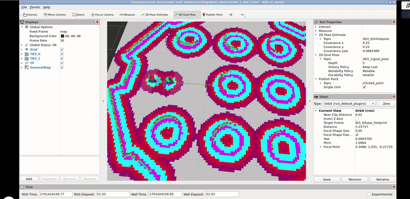

# Multi-Robot-Navigation-using-ROS2

## Overview

This code allows two robots to move to a target position whilst avoiding obstacles and each other.

The following video and GIF show a demo of the code. (https://youtu.be/ICwPvpX2lRA)

## Useful Links

1. Nav2's documentation. (https://docs.nav2.org/)
2. Adaptive Monte Carlo Localisation (AMCL). (https://wiki.ros.org/amcl)
3. Rviz2. (https://docs.ros.org/en/rolling/p/rviz2/)

## How it works

There are three main components to this: Mapping, Localisation and Path Planning

### Mapping

- The `src/cartographer_slam` package handles this.
- The launch file for this package is `src/cartographer_slam/launch/multi_cartographer.launch.py`.
- Launch the package, open Rviz2 ([see link](#useful-links)) and select the necessary topics to visualise.
- Save the map to the map_server.

### Localisation 

- The `src/localization_server` package handles this.
- AMCL ([see link](#useful-links)) has been utilised for this task.

### Path Planning
- the `src/path_planner_server` package handles this.

### Multi-Robot Path Planning

- To launch multi-robot path planning, start the following systems: Localisation, Path Planning, and Rviz2.
- Launch `src/localization_server/launch/multi_localization.launch.py`
- Launch `src/path_planner_server/launch/multi_pathplanner.launch.py`
- Launch Rviz2
- For either robot, select the "2D Goal Pose" topic from the Tool Properties section and then "/tb3_<number>/goal_pose".
- Now click on the "2D Goal Pose" button from the Rviz2 Menu and select any position on the map. The robot should move to the required destination. 

### Credits

Credits to The Construct for providing a platform to do this.
